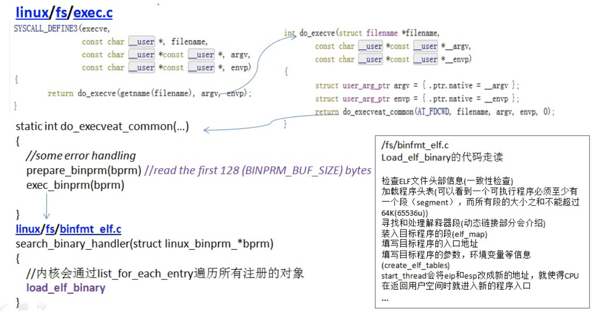

# cpp to exe
reference
- Linux环境下：程序的链接, 装载和库(https://www.bilibili.com/video/BV1hv411s7ew)


## gcc
*.c + *.h ->[preprocessing] -> *.i ->[compilation]-> *.s -> [assembly] -> *.o + lib ->[link] 

preprocess
```
  gcc -E a.cpp -o a.i       
  or 
  cpp a.cpp > a.i
```
compile
```
  gcc -S a.i -o a.s
```
assembly
```
  as a.s -o a.o
  -c                     # create object file without link
``` 

dynamic link

```
  gcc -o a a.c           # dynamic by default
```


static link need install glibc-static

```
  gcc -o a -static a.c
```


## ELF (Executable Linkage Format)
exe, obj, .so(dynamic lib), core dump

```
  file a.o
```
 查看符号表
 ```
  readelf -s a
 ```

source code
```
  /usr/include/elf.h
```


## 静态链接
need install glibc-static

```

  gcc -o a a.c           # dynamic by default
  gcc -o a -static a.c
```
or
```
  ld main.o fun.o -e main -o mains
```

1. 合并相似的段
2. 重定位


ld 会使用缺省的链接脚本


## Load
1. 分配虚拟地址空间
2. 建立虚拟地址空间和可执行文件的映射关系
3. 设置指令寄存器



## 动态链接
在装载时进行重定位

